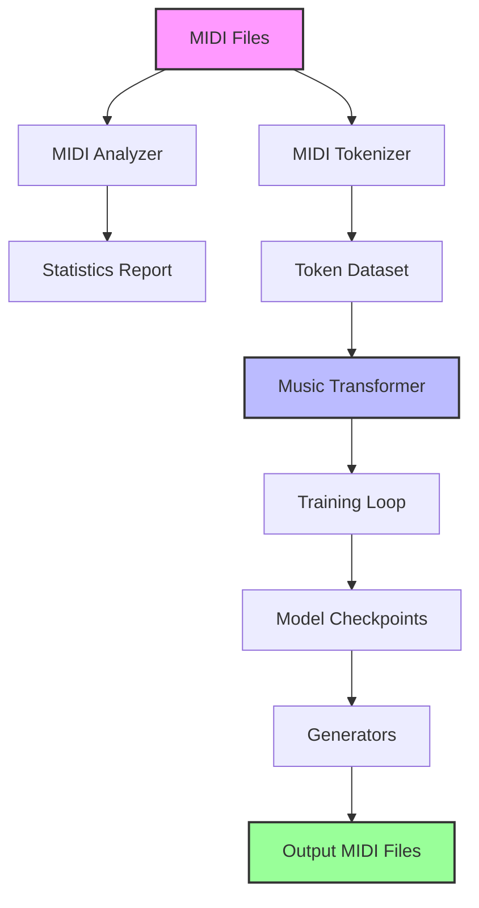
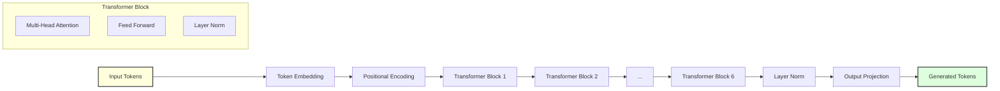

# 🎹 MIDI AI Factory

<div align="center">

[](https://www.python.org)
[](https://pytorch.org)
[](https://developer.apple.com/metal/pytorch/)
[](LICENSE)

**An AI-powered MIDI pattern generator optimized for Apple Silicon Macs**

[Overview](#overview) • [Features](#features) • [Installation](#installation) • [Usage](#usage) • [Architecture](#architecture) • [Scripts](#scripts-documentation) • [Troubleshooting](#troubleshooting)

</div>

## 📖 Overview

MIDI AI Factory is a deep learning system that generates musical patterns using a Transformer architecture optimized for Apple Silicon (M1/M2/M3/M4) processors. It can analyze existing MIDI files, learn musical patterns, and generate new melodies, chord progressions, and basslines.

### 🎯 Why MIDI AI Factory?

This project was created to provide musicians and producers with an AI-powered tool specifically optimized for Apple Silicon. By leveraging Metal Performance Shaders (MPS), we achieve up to 10x faster training compared to CPU-based solutions, making it practical to train custom models on your own MIDI collections.

### 🚀 Key Features

- ✅ **Apple Silicon Optimized**: Leverages Metal Performance Shaders (MPS) for accelerated training
- 🎼 **Multiple Generation Styles**: Create melodies, chord progressions, and basslines
- 🔧 **Flexible Architecture**: Based on Music Transformer with relative positional encoding
- 📊 **Comprehensive Pipeline**: From MIDI analysis to tokenization, training, and generation
- 🎹 **REMI+ Tokenization**: Advanced music representation for better pattern learning
- 🎵 **Multiple Output Formats**: 16-second clips or 60-second full patterns

## 🛠️ Installation

### Prerequisites

- **Apple Silicon Mac** (M1/M2/M3/M4)
- **macOS 12.0+** (Monterey or later)
- **Anaconda or Miniconda** installed
- **At least 8GB RAM** (16GB recommended)
- **10GB free disk space**

### Step-by-Step Setup

1. **Clone the repository**
```bash
git clone https://github.com/yourusername/midi-ai-factory.git
cd midi-ai-factory
```

2. **Create the conda environment**
```bash
conda env create -f environment.yml
```

3. **Activate the environment**
```bash
conda activate midi-ai
```

4. **Verify MPS support**
```bash
python -c "import torch; print(f'MPS available: {torch.backends.mps.is_available()}')"
```

You should see: `MPS available: True`

## 📁 Project Structure

```
midi-ai-factory/
├── 📂 midi_files/          # Your input MIDI files (CREATE THIS!)
├── 📂 output_midi/         # Generated MIDI patterns
│   ├── melodies/          # Generated melodies
│   ├── chords/            # Generated chord progressions
│   └── basslines/         # Generated basslines
├── 📂 tokenized_data/      # Processed token data (auto-created)
├── 📂 checkpoints/         # Model checkpoints (auto-created)
├── 📄 main.py             # Main orchestrator script
├── 📄 model.py            # Music Transformer architecture
├── 📄 train.py            # Training pipeline
├── 📄 midi_analyzer.py    # MIDI file analysis
├── 📄 midi_tokenizer.py   # REMI+ tokenization
├── 📄 generate.py         # Basic generation
├── 📄 generate_simple.py  # Simplified generation
├── 📄 generate_advanced.py # Advanced 60s patterns
├── 📄 generate_harmonic.py # Harmonic patterns
├── 📄 generate_all_scales.py # Scale-based generation
└── 📄 environment.yml     # Conda environment config
```

⚠️ **Important**: Create the `midi_files` directory and add your MIDI files before starting!

```bash
mkdir midi_files
# Add your .mid files to this directory
```

## 🎮 Usage Guide

### 🚀 Quick Start (Recommended)

Run the complete pipeline with a single command:

```bash
python main.py all --epochs 100
```

This will:
1. Analyze your MIDI files
2. Tokenize them for training
3. Train the AI model
4. Generate sample outputs

### 📊 Step-by-Step Execution

For more control, run each step separately:

#### 1️⃣ Analyze MIDI Files
```bash
python main.py analyze
```
Outputs statistics about your MIDI collection.

#### 2️⃣ Tokenize MIDI Data
```bash
python main.py tokenize
```
Converts MIDI to AI-readable tokens.

#### 3️⃣ Train the Model
```bash
python main.py train --epochs 100 --batch-size 32
```
Trains the Music Transformer on your data.

#### 4️⃣ Generate Patterns
```bash
python main.py generate --n-clips 10 --style random
```
Creates new MIDI patterns.

## 📚 Scripts Documentation

### 🎹 Generation Scripts

#### 1. **Basic Generator** (`generate.py`)
```bash
python generate.py --style melody --tempo 120 --n-clips 5
```
- **Purpose**: Generate 16-second MIDI clips
- **Styles**: `melody`, `chord`, `bass`, `random`
- **Options**:
  - `--tempo`: BPM (60-200)
  - `--temperature`: Creativity (0.5-1.5)
  - `--n-clips`: Number of clips to generate

#### 2. **Simple Generator** (`generate_simple.py`)
```bash
python generate_simple.py --n_clips 10
```
- **Purpose**: Quick generation with simplified logic
- **Best for**: Testing and rapid prototyping
- **Output**: Basic MIDI patterns

#### 3. **Advanced Generator** (`generate_advanced.py`)
```bash
python generate_advanced.py --n_melodies 50 --n_chords 50 --n_basslines 50
```
- **Purpose**: Generate full 60-second patterns
- **Output**: Organized by type (melodies/chords/basslines)
- **Features**: More sophisticated pattern generation

#### 4. **Harmonic Generator** (`generate_harmonic.py`)
```bash
python generate_harmonic.py --n_songs 10 --sections 4
```
- **Purpose**: Create harmonically coherent multi-track songs
- **Features**: 
  - Generates complete songs with multiple sections
  - Creates matching melody, chords, and bass
  - Maintains key and harmonic consistency

#### 5. **Scale Generator** (`generate_all_scales.py`)
```bash
python generate_all_scales.py --n_per_scale 5
```
- **Purpose**: Generate patterns in all major and minor scales
- **Output**: 24 scales × N patterns each
- **Use case**: Creating scale-specific training data

### 🔧 Utility Scripts

#### **MIDI Analyzer** (`midi_analyzer.py`)
```bash
python midi_analyzer.py
```
- Analyzes all MIDI files in `midi_files/`
- Outputs statistics: tempo, duration, note count
- Creates `midi_analysis.json` report

#### **MIDI Tokenizer** (`midi_tokenizer.py`)
```bash
python midi_tokenizer.py
```
- Converts MIDI to REMI+ tokens
- Segments into 16-second clips
- Saves to `tokenized_data/`

## 🏗️ Architecture

### System Architecture



### Music Transformer Architecture



### Model Specifications

```python
# Default configuration (model.py)
model_config = {
    'vocab_size': 512,      # Token vocabulary size
    'd_model': 512,         # Model dimension
    'n_heads': 8,           # Attention heads
    'n_layers': 6,          # Transformer layers
    'd_ff': 2048,           # Feed-forward dimension
    'max_seq_len': 512,     # Maximum sequence length
    'dropout': 0.1          # Dropout rate
}
```

## 🎼 Generation Parameters

### Temperature Control

Temperature affects the randomness of generation:

- **0.5-0.7**: Conservative, repetitive patterns
- **0.8-1.0**: Balanced creativity (recommended)
- **1.1-1.5**: Experimental, may be chaotic

### Sampling Strategies

- **Top-K**: Limits choices to K most likely tokens
- **Top-P**: Nucleus sampling for dynamic vocabulary
- **Temperature**: Controls distribution sharpness

Example:
```python
# Conservative generation
generator.generate_midi_clip(
    temperature=0.8,
    top_k=40,
    top_p=0.9
)

# Creative generation
generator.generate_midi_clip(
    temperature=1.2,
    top_k=100,
    top_p=0.95
)
```

## 🔧 Advanced Configuration

### Custom Model Architecture

Edit `train.py` to modify the model:

```python
model_config = {
    'vocab_size': 1024,     # Larger vocabulary
    'd_model': 768,         # Bigger model
    'n_heads': 12,          # More attention
    'n_layers': 8,          # Deeper network
    'd_ff': 3072,           # Larger FFN
    'max_seq_len': 1024,    # Longer sequences
    'dropout': 0.15         # More regularization
}
```

### Custom Generation Styles

Add new styles in `generate.py`:

```python
elif style == "jazz":
    base_tokens.extend([
        "Position_0",
        "Chord_Cmaj7",
        "Position_96",
        "Chord_Dm7",
        "Position_192",
        "Chord_G7"
    ])
elif style == "edm":
    base_tokens.extend([
        "Position_0",
        "Pitch_36",  # Kick
        "Velocity_127",
        "Duration_24"
    ])
```

## 🐛 Troubleshooting

### Common Issues

#### "MPS not available"
```bash
# Check PyTorch installation
python -c "import torch; print(torch.__version__)"

# Reinstall PyTorch for Apple Silicon
conda install pytorch torchvision torchaudio -c pytorch
```

#### "Out of memory"
```python
# Reduce batch size in train.py
training_config = {
    'batch_size': 16,  # Reduced from 32
    # ...
}
```

#### "No MIDI files found"
```bash
# Check directory structure
ls midi_files/
# Should show .mid files

# Create directory if missing
mkdir -p midi_files
```

#### "Training loss not decreasing"
- Increase learning rate: `--lr 5e-4`
- Check data quality
- Ensure diverse training data
- Train for more epochs

### Performance Optimization

#### For M1/M2 (8GB RAM)
```python
# Reduce memory usage
model_config = {
    'd_model': 256,
    'n_layers': 4,
    'max_seq_len': 256
}
training_config = {
    'batch_size': 16
}
```

#### For M1/M2 Pro/Max (16GB+ RAM)
```python
# Use default settings or increase
model_config = {
    'd_model': 768,
    'n_layers': 8,
    'max_seq_len': 1024
}
training_config = {
    'batch_size': 64
}
```

## 📊 Performance Metrics

### Expected Performance

| Hardware | Training Speed | Generation Time | Recommended Batch Size |
|----------|---------------|-----------------|----------------------|
| M1 | ~30s/epoch | <1s/clip | 16 |
| M1 Pro | ~20s/epoch | <1s/clip | 32 |
| M1/M2 Max | ~15s/epoch | <1s/clip | 64 |
| M2 Ultra | ~10s/epoch | <1s/clip | 128 |

### Training Tips

1. **Start small**: Begin with 50 epochs to test
2. **Monitor loss**: Should decrease steadily
3. **Check outputs**: Generate samples every 10 epochs
4. **Early stopping**: Stop if loss plateaus

## 🎵 Working with Generated MIDI

### DAW Integration

#### Ableton Live
1. Drag MIDI files from `output_midi/` to Live
2. Assign to instrument tracks
3. Quantize if needed (Cmd+U)

#### Logic Pro
1. File → Import → MIDI File
2. Select generated files
3. Choose tracks for import

#### FL Studio
1. Drag into playlist
2. Route to instruments
3. Edit in piano roll

### Post-Processing Tips

1. **Humanization**: Add velocity variations
2. **Timing**: Apply subtle timing offsets
3. **Layering**: Combine multiple generations
4. **Effects**: Add reverb/delay for depth

## 🤝 Contributing

We welcome contributions! Here's how:

1. Fork the repository
2. Create your feature branch:
   ```bash
   git checkout -b feature/amazing-feature
   ```
3. Commit your changes:
   ```bash
   git commit -m 'Add amazing feature'
   ```
4. Push to branch:
   ```bash
   git push origin feature/amazing-feature
   ```
5. Open a Pull Request

### Development Guidelines

- Follow PEP 8 style guide
- Add docstrings to functions
- Include tests for new features
- Update documentation

## 📄 License

This project is licensed under the MIT License - see the [LICENSE](LICENSE) file for details.

## 🙏 Acknowledgments

- Built with [PyTorch](https://pytorch.org/) optimized for Apple Silicon
- Uses [MidiTok](https://github.com/Natooz/MidiTok) for MIDI tokenization
- Inspired by [Music Transformer](https://arxiv.org/abs/1809.04281) architecture
- [Pretty MIDI](https://github.com/craffel/pretty-midi) for MIDI manipulation

## 📬 Support

- **Issues**: [GitHub Issues](https://github.com/yourusername/midi-ai-factory/issues)
- **Discussions**: [GitHub Discussions](https://github.com/yourusername/midi-ai-factory/discussions)
- **Email**: andradeolivier@gmail.com

